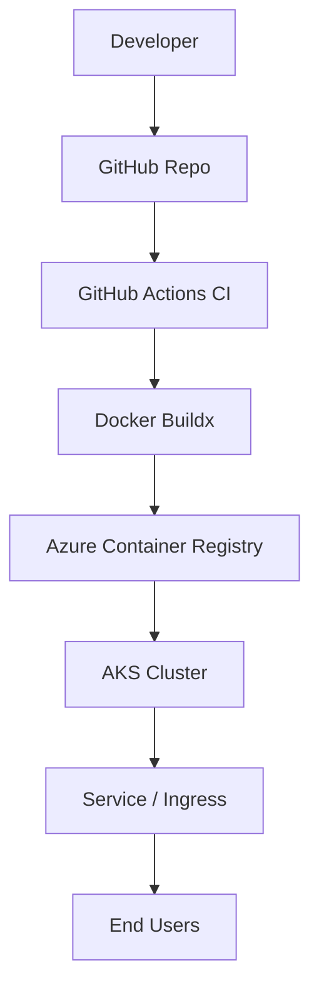
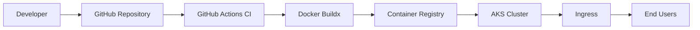

# Platform architecture

This document describes the target platform architecture and delivery flow for the DevOps Platform Stack project.

---

## High-level overview

The platform is designed as a cloud-native delivery system that automates the full lifecycle of an application:

Source → Build → Package → Store → Deploy → Operate

The core objective is to separate:
- application concerns  
- platform concerns  
- infrastructure concerns  

and automate the interfaces between them.

---

## Delivery flow

1. Developer pushes code to GitHub  
2. GitHub Actions CI validates the codebase  
3. Docker image is built using Buildx  
4. Image is tagged and prepared for registry  
5. GitHub Actions authenticates to Azure using OIDC  
6. Image is pushed to Azure Container Registry  
7. Terraform provisions/updates platform infrastructure  
8. Kubernetes manifests / Helm charts deploy the workload to AKS  
9. Ingress exposes the service externally  

---

## Cloud platform components

- **Azure Kubernetes Service (AKS)**  
  Managed Kubernetes cluster hosting application workloads.

- **Azure Container Registry (ACR)**  
  Private registry for application images.

- **Terraform**  
  Infrastructure as code for provisioning and evolving the platform.

- **GitHub Actions**  
  CI/CD engine for builds, image workflows and deployment automation.

- **Helm & Kubernetes manifests**  
  Application release configuration and runtime resources.

---

## Security architecture

- Federated identity (OIDC) from GitHub to Azure  
- Azure RBAC for scoped permissions  
- No long-lived credentials stored in pipelines  
- Infrastructure defined and reviewed as code  

---

## Architecture diagram

The target architecture is visualized below (Mermaid):

---

## Platform boundaries

- Application teams own:  
  source code, tests, container image

- Platform layer owns:  
  CI/CD, clusters, registries, security model

- Infrastructure layer owns:  
  Terraform, environments, cloud resources

---

## Delivered capabilities

- Remote Terraform state + environment promotion  
- OIDC GitHub → Azure authentication  
- AKS node pool scaling + policies  
- Observability (logs, metrics, health)  
- Secrets management (Key Vault CSI)  
- GitOps-style deployment workflow

---

## Architecture diagram (Mermaid)

